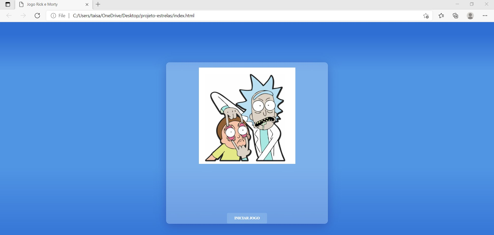
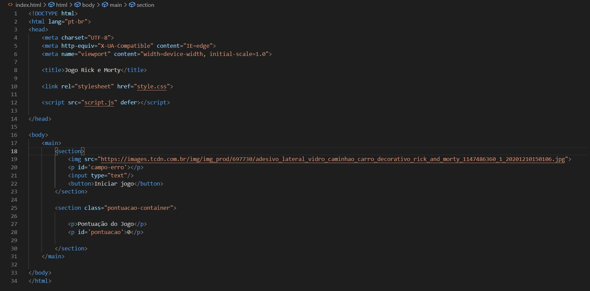
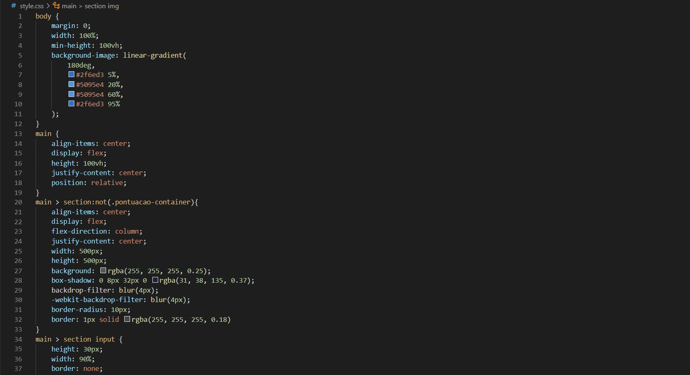
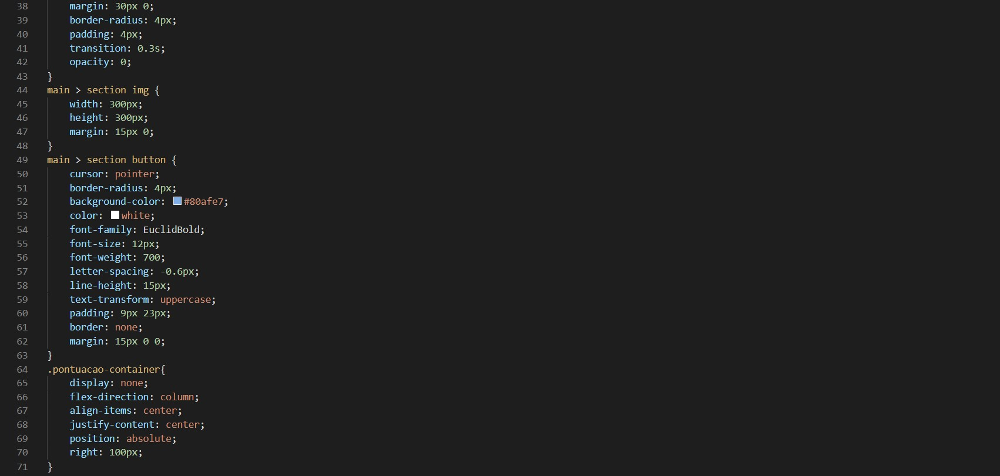
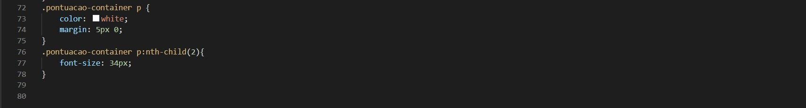
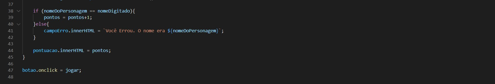
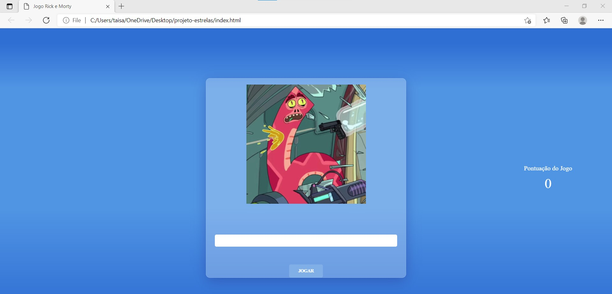
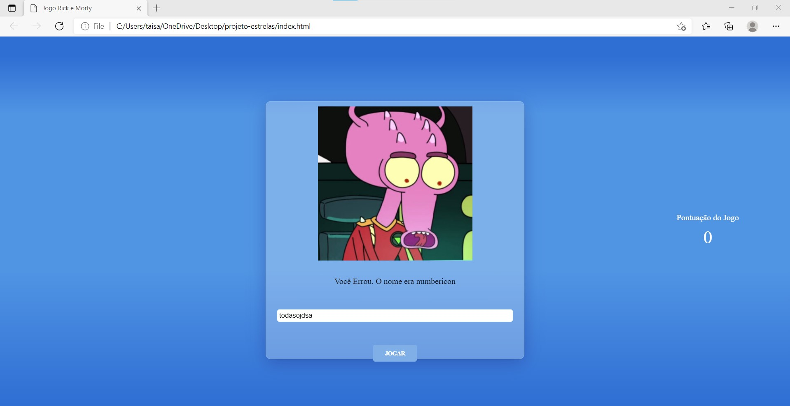
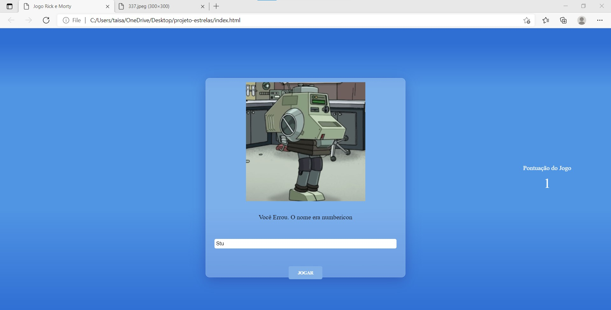

# Minicurso - Projeto Estrelas Fora da Caixa

​	Este foi um projeto desenvolvido durante o minicurso para o processo seletivo do projeto Estrelas fora da Caixa 2021, este exercício foi desenvolvido com a ajuda de um professor. Foi construído uma página WEB utilizando os personagens do API, Rick and Morty. O obejtivo era desenvolver um site onde o usuário  pudesse digitar o nome dos personagens, e se acertar ganha um ponto, se errar, uma mensagem de ERRO aparece.

​	Foram usadas as tecnologias HTML, CSS e JAVASCRIPT, e o editor de código Visual Studio Code.

### Resultado Final

### HTML

### CSS

### JAVASCRIPT

### Resultado

